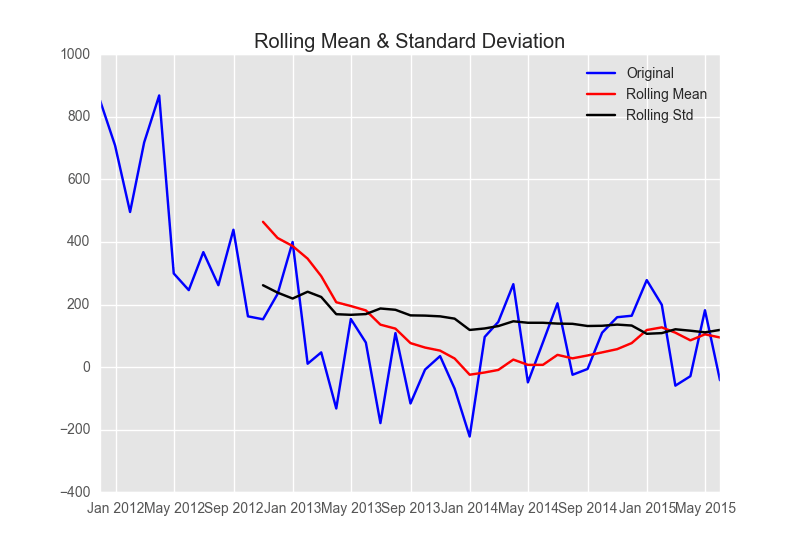
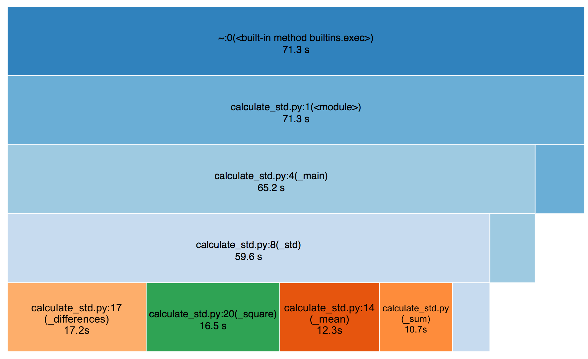
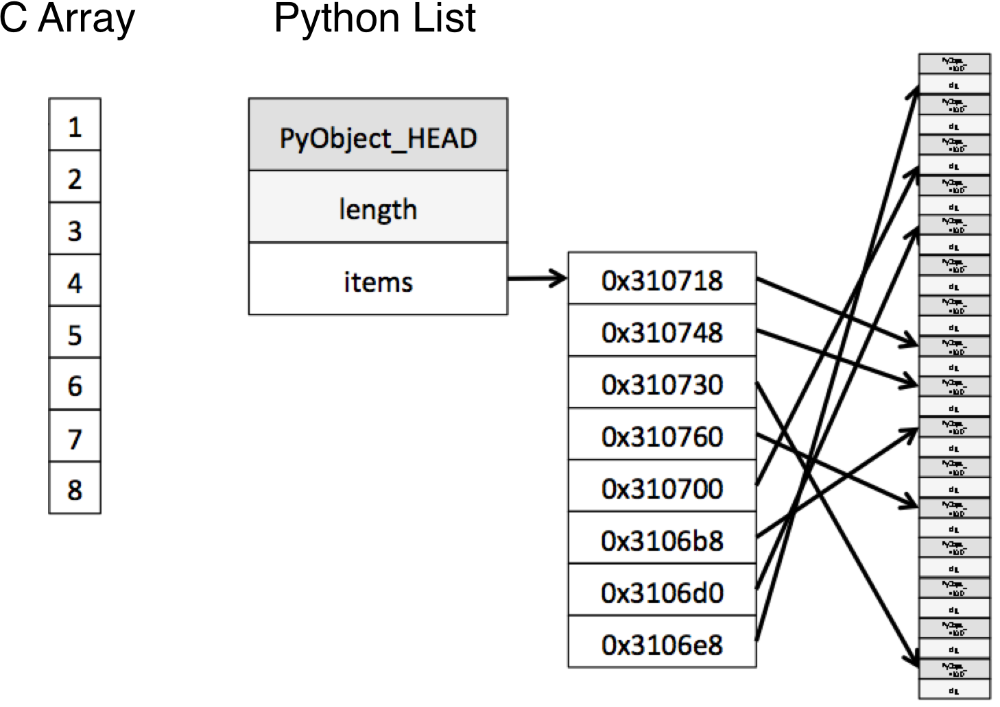
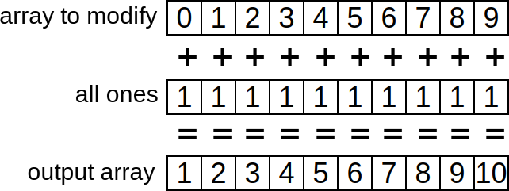
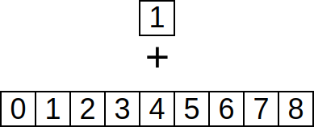
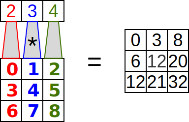

<!-- .slide: data-background="images/intro_background.png" class="background" -->
### **Высокоэффективная обработка данных в Phyton**

#### High Performance Data Processing In Python

<p>
  <a href="http://twitter.com/donald_whyte">@donald_whyte</a>
</p>

<div id="logo-notice">
  
</div>

[NEXT]
<!-- .slide: data-background="images/intro_background.png" class="background" -->
### About Me

<div class="left-col">
  
</div>
<div class="right-col" style="text-center: left">
  <ul>
    <li>Software Engineer</li>
    <li>@ Engineers Gate</li>
    <li>Scalable data infrastructure</li>
    <li>Real-time trading systems</li>
    <li>Python/C++/Rust developer</li>
  </ul>
</div>
<div class="clear-col"></div>

[NEXT]
<!-- .slide: data-background="images/intro_background.png" class="background" -->
**Python is a hugely popular tool for data analysis.**

[NEXT]
<!-- .slide: data-background="images/intro_background.png" class="background" -->

> **Data analysis is now as popular as web development with Python.**

<div class="reference">
  *JetBrains Python Developer Survey 2017* **[1]**
</div>

_note_
https://www.jetbrains.com/research/python-developers-survey-2017/

[NEXT]
<!-- .slide: data-background="images/intro_background.png" class="background" -->
## Why?

[NEXT]
<!-- .slide: data-background="images/intro_background.png" class="background" -->
High-level and easy to use.

Wealth of tools for processing/analysing data.

General-purpose language useful outside of data analysis.

[NEXT]
<!-- .slide: data-background="images/intro_background.png" class="background large-slide" -->
Great language for **research**.

[NEXT]
<!-- .slide: data-background="images/intro_background.png" class="background large-slide" -->
What about **production?**

[NEXT]
<!-- .slide: data-background="images/intro_background.png" class="background" -->
### Isolated to Research?


Large data analysis/processing used to be isolated to research.

One-off batch jobs to produce insight for research and decision making.

_note_
Data analysis used to only be active in the realm of research. Analysts would
write one-off jobs that cleaned up data and analysed it. The findings would
then be included in research papers, presentations to management in firms and so on.

It was very rare that you'd run such heavy data analysis frequently in live
production systems.

[NEXT]
<!-- .slide: data-background="images/ml_landscape_dec15.jpg" class="background" -->
### Things Have Changed

Exponential growth of data.

Need real-time insights into this data.

Machine learning/stats models are running in live production systems.

_note_
Source: https://insidebigdata.com/2017/02/16/the-exponential-growth-of-data/

[NEXT]
<!-- .slide: data-background="images/intro_background.png" class="background" -->
## Artificial Intelligence
### Projected Global Revenue
<div id="deep-learning-revenue"></div>

<div class="source">
  <p>
    Source: [Tractica December 2017](https://www.tractica.com/newsroom/press-releases/artificial-intelligence-software-market-to-reach-89-8-billion-in-annual-worldwide-revenue-by-2025/)
  </p>
</div>

_note_
Artificial Intelligence software market projected to reach almost $90 billion
by 2025.

[NEXT]
<!-- .slide: data-background="images/intro_background.png" class="background" -->
More data to process.

More numerical models being trained for live use.

Models larger and more complex.

[NEXT]
<!-- .slide: data-background="images/intro_background.png" class="background large-slide" -->
**Strict time requirements.**

[NEXT]
<!-- .slide: data-background="images/intro_background.png" class="background" -->
### The Traditional Process

1. Researcher builds model in their tech of choice
2. Programmer takes research code and rewrites it in heavily optimised C/C++
3. Production code is deployed
4. _Everything works fine_

[NEXT]
<!-- .slide: data-background="images/intro_background.png" class="background" -->
### Success!


[NEXT]
<!-- .slide: data-background="images/intro_background.png" class="background" -->
### The Reality


[NEXT]
<!-- .slide: data-background="images/intro_background.png" class="background" -->
### The Reality
1. Researcher builds model that works on their machine
2. Programmer attempts to rewrite model for production
3. Programmer can't replicate the researcher's results
4. Everything spends tons of time figuring out why

_note_
Useful link discussing deplyoying models to prod: https://www.quora.com/How-do-you-take-a-machine-learning-model-to-production

[NEXT]
<!-- .slide: data-background="images/intro_background.png" class="background" -->
### Results in...


* Significant deployment delays
* Compromises on model accuracy to release it faster

[NEXT]
<!-- .slide: data-background="images/intro_background.png" class="background" -->
### A Better Process
Research and production code is **identical**.

_note_
A better process is to make the research and production code **identical**.
They can be configured differently, but the code which pre-processes the data,
trains the models and executes it in prod should be the same.

[NEXT]
<!-- .slide: data-background="images/intro_background.png" class="background" -->
### Problem
Want to use Python.

Enables researchers to run experiments quickly.

But Pure Python is **slow**.

_note_
But we like Python because it's easy to use for research.

[NEXT]
<!-- .slide: data-background="images/intro_background.png" class="background" -->
### Python vs. C Performance
<div id="python-vs-c-times"></div>

<div class="source">
  <p>
    Source: [The Computer Language Benchmarks Game](https://benchmarksgame-team.pages.debian.net/benchmarksgame/faster/python3-gcc.html)
  </p>
</div>

[NEXT]
<!-- .slide: data-background="images/intro_background.png" class="background" -->
### Speedup using C
<div id="python-vs-c-speedups"></div>

<div class="source">
  <p>
    Source: [The Computer Language Benchmarks Game](https://benchmarksgame-team.pages.debian.net/benchmarksgame/faster/python3-gcc.html)
  </p>
</div>

[NEXT]
<!-- .slide: data-background="images/intro_background.png" class="background" -->
### Solution
Python's ecosystem for data science.

[NEXT]
<!-- .slide: data-background="images/ecosystem.png" -->

[NEXT]
<!-- .slide: data-background="images/ecosystem_marked.png" -->

[NEXT]
<!-- .slide: data-background="images/intro_background.png" class="background" -->
### NumPy

<div class="left-col">
  <ul>
    <li>Heart of scientific computing in Python</li>
    <li>Stores and operates on data in C structures</li>
    <li>Avoids slowness of Python</li>
  </ul>
</div>
<div class="right-col">
  <div style="height: 20px"></div>
  
</div>
<div class="clear-col"></div>

[NEXT]
<!-- .slide: data-background="images/intro_background.png" class="background" -->
Foundation of most scientific computing packages.


[NEXT]
<!-- .slide: data-background="images/intro_background.png" class="background" -->
## Our Focus

Showing how to use NumPy to process numerical data.

Exploring how NumPy leverages vectorisation to dramatically boost performance.

[NEXT]
<!-- .slide: data-background="images/intro_background.png" class="background" -->
### Outline

1. Analyse a large weather dataset
2. Process dataset in **pure Python**
3. Speed up processing using **NumPy** and vectorisation
4. Speed up processing even more using **Numba**

[NEXT]
<!-- .slide: data-background="images/intro_background.png" class="background large-slide" -->
## Final Optimised Solution

1145 times faster than pure Python.


[NEXT SECTION]
## 1. The Dataset


[NEXT]
### Integrated Surface Database (ISD)


_note_
Global database of atmospheric weather data.

This map shows the spatial distribution of Integrated Surface Database
stations. Data has been collected from 35,000 weather stations scattered across the globe.

Source: https://www.ncdc.noaa.gov/isd

[NEXT]
## Measurements

<div class="left-col" style="text-center: center;">
  <p>wind speed and direction</p>
  <p>temperature</p>
  <p>sea level pressure</p>
  <p>sky visibility</p>
</div>
<div class="right-col">
  
</div>
<div class="clear-col"></div>

_note_
Detailed list of fields:

wind speed and direction, wind gust, temperature, dew point, cloud data, sea level pressure, altimeter setting, station pressure, present weather, visibility, precipitation amounts for various time periods, snow depth, and various other elements as observed by each station.

[NEXT]
## Coverage

<div class="left-col">
  
</div>
<div class="right-col" style="text-center: left; padding-top: 12px">
  <p>7 continents</p>
  <p>35,000 weather stations</p>
  <p>1901 to now</p>
  <p>from over 100 data sources</p>
</div>
<div class="clear-col"></div>

[NEXT]
<!-- .slide: class="large-slide" -->
**Total Data Volume > 600GB**

_note_
ISD integrates data from over 100 original data sources, including numerous data formats that were key-entered from paper forms during the 1950s–1970s time frame

[NEXT]
### Example


[NEXT]
| **timestamp**       | **station_id** | **wind_speed_rate** | *...* |
| ------------------- | -------------- | ------------------- | ----- |
| 1995-01-06 03:00:00 | 407060         | 50.0                | ...   |
| 1995-01-06 06:00:00 | 407060         | 70.0                | ...   |
| 1995-01-06 09:00:00 | 407060         | null                | ...   |
| 1995-01-06 12:00:00 | 407060         | 60.0                | ...   |
| 1995-01-06 16:00:00 | 407060         | 20.0                | ...   |

_note_
Wind speed rate = the rate of horizontal travel of air past a fixed point.

UNITS: meters per second
SCALING FACTOR: 10
MISSING VALUE: -9999

http://www.polmontweather.co.uk/windspd.htm

[NEXT]
### Tabriz Wind Speed Rate
### Over Two Days


(2011-12-29 to 2011-12-31)
<!-- .element class="source" -->

[NEXT]
# Research Goal
Use IDS data to detect extreme weather events that happen anywhere on the planet.

[NEXT]
## Initial Goal
### Detecting hurricanes


[NEXT]
### ISD-Lite Dataset

Let's test our approach on a smaller dataset.

|                 |                          |
| --------------- | ------------------------ |
|**Dates**        | 1991-01-01 to 2011-12-31 |
|**Measurement**  | Wind Speed Rate          |
|**Stations**     | ~6000                    |
|**Rows**         | ~400,000,000             |

_note_
Total stations: 5,700
Total rows: 391,908,527


[NEXT SECTION]
## 2. Pure Python


[NEXT]
How do we detect hurricanes?

Finding data points with unusually low/high `wind_speed_rate` values.

[NEXT]
### Detecting Outliers


[NEXT]
### Detecting Outliers

At each point `i` in the time series:

1. Take values in time series between points `i - 30` and `i`
2. Calculate mean and standard deviation
3. Value at `i` is an outlier if it's:
  - more than **6 standard deviations** away from the mean

[NEXT]


[NEXT]
### Problem: Null Values
<table>
  <tr>
    <th>timestamp</th>
    <th>station_id</th>
    <th>wind_speed_rate</th>
  </tr>
  <tr><td>1995-01-06 03:00:00</td><td>407060</td><td>50.0</td></tr>
  <tr><td>1995-01-06 06:00:00</td><td>407060</td><td>70.0</td></tr>
  <tr class="bad-row"><td>1995-01-06 09:00:00</td><td>407060</td><td>null</td></tr>
  <tr><td>1995-01-06 12:00:00</td><td>407060</td><td>70.0</td></tr>
  <tr><td>1995-01-06 17:00:00</td><td>407060</td><td>20.0</td></tr>
</table>

[NEXT]
### Solution: Fill Forward
<table>
  <tr>
    <th>timestamp</th>
    <th>station_id</th>
    <th>wind_speed_rate</th>
  </tr>
  <tr><td>1995-01-06 03:00:00</td><td>407060</td><td>50.0</td></tr>
  <tr><td>1995-01-06 06:00:00</td><td>407060</td><td>70.0</td></tr>
  <tr class="good-row"><td>1995-01-06 09:00:00</td><td>407060</td><td>70.0</td></tr>
  <tr><td>1995-01-06 12:00:00</td><td>407060</td><td>70.0</td></tr>
  <tr><td>1995-01-06 17:00:00</td><td>407060</td><td>20.0</td></tr>
</table>

[NEXT]
## Complete Process


_note_
1. Split full dataset into separate station time series
2. For each weather station time series, detect outliers by:
  1. calculate rolling mean and stdev at each point
  2. check if a point is > 6 stdevs away from its rolling mean value
  3. if so, mark point as outlier
3. generate CSV containing all outliers in each station's data

[NEXT]
### The Input

**HDF5** file containing three columns:
  - `station_id`
  - `timestamp`
  - `wind_speed_rate`

[NEXT]
## HDF5

* **H**ierarchical **D**ata **F**ormat
* Designed to store large amounts of binary data
* No text parsing required
* Efficient to load

<div class="source">
[more information on this format here](https://www.hdfgroup.org/HDF5/)
</div>

_note_
HDF5 is an open source file format for storing huge amounts of numerical data.

It’s typically used in research applications (meteorology, astronomy, genomics etc.) to distribute and access very large datasets without using a database.

It lets you store huge amounts of numerical data, and easily manipulate that data from NumPy. For example, you can slice into multi-terabyte datasets stored on disk, as if they were real NumPy arrays. Thousands of datasets can be stored in a single file, categorized and tagged however you want.

[NEXT]
### Invariants

Rows sorted by `(station_id, timestamp)`.

Each station's rows are **grouped together**.

Ordered by time.


[NEXT]
### The Code

Source file: `find_outliers_purepy.py`

<pre class="medium"><code data-noescape class="bash">&gt; git clone https://github.com/DonaldWhyte/high-performance-data-processing-in-python/
&gt; cd high-performance-data-processing-in-python/
&gt; cd code/
&gt; python3 -m find_outliers_purepy --help
usage: find_outliers_numpy.py [-h] -i INPUT -m MEASUREMENT -o OUTPUT

optional arguments:
  -h, --help            show this help message and exit
  -i INPUT, --input INPUT
                        path to input HDF5 file containing data to find
                        outliers in
  -m MEASUREMENT, --measurement MEASUREMENT
                        measurement to find outliers in
  -o OUTPUT, --output OUTPUT
                        name of output CSV file that contains outliers
</code></pre>

[NEXT]
### Code Breakdown

|                   |                                                         |
| ----------------- | ------------------------------------------------------- |
| `station_ranges`  | partition full dataset into per-station time series     |
| `fill_forward`    | fill in missing data with previous values               |
| `rolling_average` | computing rolling average at every time point           |
| `rolling_std`     | computing rolling stdev at every time point             |
| `find_outliers`   | get indices of outliers using deviance from rolling avg |
<!-- .element class="medium-table-text" -->

[NEXT]
TODO: create this diagram


[NEXT]
### Running the Code

```
> python3 -m find_outliers_purepy \
    --input isdlite.hdf5 \
    --output outliers.csv \
    --measurement wind_speed_rate
```

```
Determining range of each station time series
Found time series for 5183 ranges
Removing time series that don't have enough data
Kept 4695 / 5183 station time series
Computing outliers
Computed outliers in 14499.84 seconds
Writing outliers to outliers.csv
```

[NEXT]
### Output Outliers CSV

| **station_id** | **timestsamp**      | **wind_speed_rate** |
| -------------- | ------------------- | ------------------- |
| 720346         | 1996-04-25 11:00:00 | 110.0               |
| 720358         | 1997-01-31 09:00:00 | 40.0                |
| 997375         | 1993-01-29 15:00:00 | 100.0               |
| ...            | ...                 | ...                 |


[NEXT]
### Outliers Found

Total outliers: 4982

```bash
> wc -l outliers.csv
4982
```

[NEXT]
### Outliers Found

Detected outliers in 1313 weather stations.

On average, those stations had 3.8 outliers.

```bash
> cat outliers.csv | cut -d ',' -f 1 | sort | uniq | wc -l
1313
```

[NEXT]
Some detected outliers:

```bash
997299,2006-09-01 09:00:00,400.0
997299,2006-09-01 12:00:00,400.0
```

The affected weather station is:
```bash
> grep 997299 stations.csv
"997299","99999","CHEASAPEAKE BRIDGE","US","VA","","+36.970","-076.120","+0016.0","20050217","20161231"
```

[NEXT]


[NEXT]


[NEXT]


[NEXT]
### Success!


[NEXT]
<!-- .slide: class="large-slide" -->
## Time Taken
4 hours.

[NEXT]
## The Ultimate Goal
Use IDS data to detect extreme weather events that happen anywhere on the planet.

[NEXT]
### Detecting Outliers in the Full Dataset

All 8 measurements.

All 35,000 weather stations.

From 1901 to now.

_note_
What if we ran the same outlier detection code on the full dataset?

[NEXT]
<!-- .slide: class="large-slide" -->
It would take **27 days**.


[NEXT]
<!-- .slide: class="large-slide" -->
What went wrong?

[NEXT]
### Profiling the Code

Use `cProfile` to find out which steps were the performance bottlenecks.

<pre class="large"><code data-noescape class="python"><mark>&gt; python3 -m cProfile -o profile_output \</mark>
     find_outliers_purepy.py \
     --input isdlite.hdf5 \
     --output outliers.csv \
     --measurement wind_speed_rate
</code></pre>

[NEXT]
### Visualising Performance Bottlenecks

`snakeviz` generates visualisations of profiling data.

```bash
> pip3 install snakeviz
> snakeviz profile_output
```
<!-- .element class="large" -->

[NEXT]
### Example

Calculating standard deviation of 100 million integers.

```python
def _main():
    a = list(range(100000000))
    _std(a)

def _std(a):
    mean = _mean(a)
    squared_differences = _square(_differences(a, mean))
    sum_of_sq_diffs = _sum(squared_differences)
    return math.sqrt(sum_of_sq_diffs / len(a) - 1)

def _mean(a):
    return _sum(a) / len(a)

def _differences(a, mean):
    return [x - mean for x in a]

def _square(a):
    return [x * x for x in a]

def _sum(a):
    s = 0
    for x in a:
        s += x
    return s

def _divide(a, d):
    return [x / d for x in a]
```

[NEXT]
### Snakeviz Output



[NEXT]
## Finding Outliers
### Execution Time Breakdown

[NEXT]
**Total time:** 4 hours (14530 secs)

<div id="purepython-times"></div>

[NEXT]
**Total time:** 4 hours (14530 secs)

<div id="purepython-times-log"></div>

[NEXT]
<!-- .slide: class="large-slide" -->
Why is Python so slow?

_note_
Source for upcoming sections: https://jakevdp.github.io/blog/2014/05/09/why-python-is-slow/

[NEXT]
## Reason 1
### Dynamic Typing

[NEXT]
When a Python program executes, the interpreter doesn't know the type of the
variables that are defined.


[NEXT]
More instructions needed for any operation.

**Primary reason** Python is slower than C or other compiled languages
for processing numerical data.

[NEXT]
## Reason 2
### Interpreted, not Compiled

[NEXT]
Python code is interpreted at runtime.

Quick to iterate, but gives less chance to optimise.

During compilation, a smart compiler can look ahead and optimise inefficient code.

_note_
See section 5 to learn see how compiling Python code can dramatically speed up
code.

[NEXT]
## Reason 3
### Fragmented Memory Access

[NEXT]


[NEXT]
Bad for code that steps through **data in sequence**.

Iterate through a single list accesses completely different regions of memory.

Not **cache friendly**.


[NEXT SECTION]
## 3. Numpy


[NEXT]
### The Foundation
Fundamental package for high performance computing in Python.

Many libraries/frameworks are built on top of NumPy.

[NEXT]
### Features

* multi-dimensional array objects
* routines for fast operations on arrays
  - mathematical, logical, sorting, selecting
* statistical operations
* efficient loading/saving of numerical data to disk
  - including HDF5

[NEXT]
`numpy.ndarray`

* class encapsulating n-dimensional arrays
* fixed size
* elements must be the same type
* no memory overhead
  - elements stored in single contiguous memory block
* fast logical and mathematical operations
  - executed in heavily optimised compiled code

_note_
At the core of the NumPy package, is the ndarray object. This encapsulates
n-dimensional arrays of homogeneous data types, with many operations being
performed in compiled code for performance.

[NEXT]
## Examples

```python
import numpy as np
```
<!-- .element: class="large" -->

[NEXT]
### Creating an Array

```python
>>> a = np.arange(9, dtype=np.float64)
>>> a
array([0., 1., 2., 3., 4., 5., 6., 7., 8.])
>>> a.shape
(9,)
>>> a.strides
(8,)
```
<!-- .element: class="large" -->

[NEXT]
### Memory Layout


_note_
A NumPy array in its simplest form is a Python object build around a C array.
That is, it has a pointer to a contiguous data buffer of values.

`data` is pointer indicating the memory address of the first byte in the array.

`dtype` indicates the type of elements stored in the array.

`shape` indicates the shape of the array. That is, it defines the dimensionality
of the data in the array and how many elements the array stores for each dimension.

The `strides` are the number of bytes that should be skipped in memory to go to the next element. If your strides are (32, 8), you need to proceed 8 bytes to get to the next column and 32 bytes to move to the next row.

`flags` is a set of configurable flags we don't need to cover here.

### Python View


[NEXT]
### Reshape

```python
>>> b = a.reshape(3, 3)
>>> b
array([[0., 1., 2.],
       [3., 4., 5.],
       [6., 7., 8.]])
```


[NEXT]
### Transpose

```python
>>> b.T
array([[0., 3., 6.],
       [1., 4., 7.],
       [2., 5., 8.]])
```


[NEXT]
### Slicing One Dimension

```python
>>> b[:, :2]
array([[0., 1.],
       [3., 4.],
       [6., 7.]])
```


[NEXT]
### Slicing Multiple Dimensions

```python
>>> b[:2, :2]
array([[0., 1.],
       [3., 4.]])
```


[NEXT]
### Only Examine Every Nth Element

```python
>>> b[::2, ::2]
array([[0., 2.],
       [6., 8.]])
```


[NEXT]
Reshaping or slicing arrays creates a **view**.

No copies are made.

[NEXT]
### Performance Benefits

* Data stored contiguously
* Cache locality
* No copies for common reshaping/slicing operations

[NEXT]
### Benchmark
#### Adding 10,000,000 Numbers

[NEXT]
### Pure Python

```python
a = list(range(10000000))
b = list(range(10000000))

# 1. indexing
c = [a[i] + b[i] for i in range(len(a))]

# 2. zip
d = [x + y for x, y in zip(a, b)]
```
<!-- .element: class="large" -->

[NEXT]
### NumPy

```python
import numpy as np

a = np.arange(10000000)
b = np.arange(10000000)

# 3. loop
c = np.zeros(len(a))
for i in range(len(a)):
    c[i] = a[i] + b[i]

# 4. built-in numpy addition operator
d = a + b
```
<!-- .element: class="large" -->

[NEXT]
### Timing (seconds)
<div id="basic-numpy-benchmark-times"></div>

[NEXT]
### Speedup Factor
<div id="basic-numpy-benchmark-speedup"></div>

[NEXT]
NumPy with loops is the slowest of all choices.

Takes **4x** longer than pure Python!

[NEXT]
### Explicitly Looping over Numpy Array


_note_
For every integer, we're making two `__getitem__` calls, performing the
addition in Python and copying each result into the output numpy array with
a call to `__setitem__`.

This dramatically slows down the computation for two reasons:

1. This adds function call overhead. We invoke four Python functions for each
   integer. That's 40,000,000 function calls.
2. It performs three copies for each addition. It copies the `i`th element of
   `a` and `b`, then copies the addition into `c`.
3. The overhead and copies destroy cache locality. The copies are likely in a
   very different part of the address space, meaning the CPU is having to do
   more work to fetch data from RAM, instead of just using its local cache.

[NEXT]
### Using Built-in Addition


_note_
The full addition logic is executed in native, compiled NumPy code. There are
no function call overheads and no copies.

The memory buffers storing `a` and `b` are directly accessed when adding.
Since those buffers are stored contiguously in memory, we're cache friendly.
The CPU has to fetch less data from RAM.

[NEXT]
### Keep it in NumPy!
Don't loop through `np.ndarray`s.

Move the computation to the NumPy/C/native code level where possible.

[NEXT]
### A Problem...
For arrays with the same size, operations are performed element-by-element.

Sometimes we want to apply smaller scalars or vectors to larger arrays.

_e.g. adding one to all elements in an array_

[NEXT]
### A Problem...
We want to use NumPy's built-in operations...

...but we don't want to perform loads of copies to match up the array sizes.

[NEXT]
### Adding 1 to an Array



Adding 1 to **N** elements would take **N -1** copies!

[NEXT]
### Broadcasting
Allows us to apply smaller arrays to larger arrays.

**Without copying.**

[NEXT]
### Broadcasting Scalar to Array


[NEXT]
### Broadcasting Scalar to Array


[NEXT]
### Broadcasting Vector to Array


[NEXT]
### Broadcasting Vector to Array


[NEXT]
Broadcasting does **not** copy.

[NEXT]
### Using NumPy for Outlier Detection

[NEXT]
### Recap

|                   |                                                         |
| ----------------- | ------------------------------------------------------- |
| `station_ranges`  | partition full dataset into per-station time series     |
| `fill_forward`    | fill in missing data with previous values               |
| `rolling_average` | computing rolling average at every time point           |
| `rolling_std`     | computing rolling stdev at every time point             |
| `find_outliers`   | get indices of outliers using deviance from rolling avg |
<!-- .element class="medium-table-text" -->

[NEXT]


[NEXT]
`station_ranges()`

```python
def station_ranges(station_ids: np.ndarray) -> np.ndarray:
    is_end_of_series = station_ids[:-1] != station_ids[1:]
    indices_where_stations_change = np.where(
      is_end_of_series == True)[0] + 1
    series_starts = np.concatenate((
        np.array([0]),
        indices_where_stations_change
    ))
    series_ends = np.concatenate((
        indices_where_stations_change,
        np.array([len(station_ids) - 1])
    ))
    return np.column_stack((series_starts, series_ends))
```

[NEXT]
```python
station_ids = np.array([123, 123, 124, 245, 999, 999])
```
<!-- .element class="large" -->


[NEXT]
```python
is_end_of_series = station_ids[:-1] != station_ids[1:]
```
<!-- .element class="large" -->  


[NEXT]
```python
indices_where_stations_change = (
    np.where(is_end_of_series == True)[0] + 1)
```
<!-- .element class="large" -->


[NEXT]
```python
series_starts = np.concatenate((
    np.array([0]),
    indices_where_stations_change
))
```
<!-- .element class="large" -->


[NEXT]
```python
series_ends = np.concatenate((
    indices_where_stations_change,
    np.array([len(station_ids) - 1])
))
```
<!-- .element class="large" -->


[NEXT]
```python
np.column_stack((series_starts, series_ends))
```
<!-- .element class="large" -->


[NEXT]
`fill_forward()`

```python
def fill_forward(arr: np.ndarray):
    for i in range(1, len(arr)):
        if np.isnan(arr[i]):
            arr[i] = arr[i - 1]
```
<!-- .element: class="large" -->

[NEXT]
`rolling_average()`

```python
def rolling_average(arr: np.ndarray,
                    n: int) -> np.ndarray:
    avg = np.zeros(len(arr) - n + 1)
    for i in range(len(avg)):
        avg[i] = arr[i:i+n].sum() / n
    return avg
```
<!-- .element: class="large" -->

[NEXT]
`rolling_std()`

```python
def rolling_std(arr: np.ndarray,
                rolling_avg: np.ndarray,
                n: int) -> np.ndarray:
    variance = np.zeros(len(arr) - n + 1)
    assert len(variance) == len(rolling_avg)
    for i in range(len(variance)):
        variance[i] = (
            np.sum(np.square(arr[i:i+n] - rolling_avg[i])) / n
        )
    return np.sqrt(variance)
```

[NEXT]
`find_outliers()`

```python
def find_outliers(data: np.ndarray,
                  rolling_avg: np.ndarray,
                  rolling_std: np.ndarray) -> np.ndarray:
    outlier_indices = np.where(
        np.absolute(data - rolling_avg) >
        (rolling_std * _OUTLIER_STD_THRESHOLD))
    return outlier_indices[0]
```

[NEXT]
**Total time:** 4 hours ⟶ 1.4 hours

**Speedup:** 2.85x

<div id="numpy-times"></div>

[NEXT]
### Why NumPy is So Much Faster

* No extra memory overhead
* Minimal copying
* Cache friendly
* Operations executed in optimised compiled code

[NEXT]
But also...

[NEXT SECTION]
## 4. Vectorisation


[NEXT]
> Process of converting an algorithm from operating on a **single** value at a
time to operating on a **set** of values at one time.

_note_
Source: https://software.intel.com/en-us/articles/vectorization-a-key-tool-to-improve-performance-on-modern-cpus

[NEXT]
Modern CPUs provide direct support for vector operations.

A **single instruction** is applied to **multiple** data points.

[NEXT]
### Adding Two Vectors
#### Single Instruction Single Data (SISD)


Adding **_N_** numbers takes **_N_** instructions.

[NEXT]
### Adding Two Vectors
#### Single Instruction Multiple Data (SIMD)


Adding **_N_** numbers takes **_N / 4_** instructions.

_note_
Basically for you as a coder, SIMD allows to perform four operations
(reading/writing/calculating) for the price of one instruction. The cost
reduction is enabled by vectorization and data-parallelism. You don’t even have
to handle threads and race conditions to gain this parallelism.

[NEXT]
### SIMD on CPUs

<div class="left-col">
  <ul>
    <li>Most modern CPUs support vectorisation.</li>
    <li>CPU with a 512 bit register can hold 8 64-bit doubles.</li>
    <li>One instruction for 8 doubles.</li>
  </ul>
</div>
<div class="right-col">
  
</div>
<div class="clear-col"></div>

[NEXT]
### SIMD on GPUs

<div class="left-col">
  <ul>
    <li>SIMD on steroids</li>
    <li>Can process thousands of floats in one "instruction"</li>
    <li>Originally made for rendering graphics.</li>
    <li>Enables neural nets to be trained with massive amounts of data.</li>
  </ul>
</div>
<div class="right-col">
  
</div>
<div class="clear-col"></div>

[NEXT]
### Example in C
#### Adding 10,000,000 Numbers

[NEXT]
### Non-Vectorised

```c
void add(float* a, float* b, float* out, int len) {
    for (int i = 0; i < len; ++i) {
        out[i] = a[i] + b[i];
    }
}
```

[NEXT]
### Vectorised

```c
void add_vectorised(float* a, float* b, float* out, int len) {
    int i = 0;
    for (; i < len - 4; i += 4) {
        out[i] = a[i] + b[i];
        out[i + 1] = a[i + 1] + b[i + 1];
        out[i + 2] = a[i + 2] + b[i + 2];
        out[i + 3] = a[i + 3] + b[i + 3];
    }
    for (; i < len; ++i) {
        out[i] = a[i] + b[i];
    }
}
```

[NEXT]
Disable optimisations to prevent compiler auto-vectorising.

```bash
clang -O0 vectorised_timings.c
```

[NEXT]
<!-- .slide: class="medium-slide" -->
**Speedup: 1.4x**
<div id="vectorise-benchmark"></div>

[NEXT]
### Vectorised Definitions

| **Context**     |                                                                                     |
| --------------- | ----------------------------------------------------------------------------------- |
| **Native Code** | Apply single operations to multiple data items at once using special CPU registers. |
| **Python**      | Keeping as much computation in `numpy`/native code as much as possible.             |

Both involve making algorithms use array/vector/matrix based computation (not iterative).

_note_
Vectorization describes the absence of any explicit looping, indexing, etc., in the code - these things are taking place, of course, just “behind the scenes” in optimized, pre-compiled C code. Vectorized code has many advantages, among which are:

* vectorized code is more concise and easier to read
* fewer lines of code generally means fewer bugs
* the code more closely resembles standard mathematical notation (making it easier, typically, to correctly code mathematical constructs)
* vectorization results in more “Pythonic” code. Without vectorization, our code would be littered with inefficient and difficult to read for loops.

[NEXT]
### Vectorisation for Outlier Detection

[NEXT]
**Unvectorised `fill_forward()`**

```python
def fill_forward(arr: np.ndarray):
    for i in range(1, len(arr)):
        if np.isnan(arr[i]):
            arr[i] = arr[i - 1]
```
<!-- .element: class="large" -->

[NEXT]
**Vectorised `fill_forward()`**

```python
def fill_forward(arr: np.ndarray) -> np.ndarray:
    mask = ~np.isnan(arr)
    indices = np.arange(len(arr))
    indices_to_use = np.where(mask, indices, 0)
    np.maximum.accumulate(indices_to_use, out=indices_to_use)
    return arr[indices_to_use]
```
<!-- .element: class="large" -->

[NEXT]
```python
# wind_speed_rate measurements for a single weather station.
arr = np.array([
    20, 5, 3, 8, np.nan, np.nan, 6, np.nan, 25, 5
])
```


[NEXT]
```python
mask = ~np.isnan(wind_speed_rates)
```
<!-- .element: class="large" -->


[NEXT]
```python
mask = ~np.isnan(wind_speed_rates)
```
<!-- .element: class="large" -->


[NEXT]
```python
indices_to_use = np.where(mask, indices, 0)
```
<!-- .element: class="large" -->


[NEXT]
```python
np.maximum.accumulate(indices_to_use, out=indices_to_use)
return wind_speed_rates[indices_to_use]
```
<!-- .element: class="large" -->


[NEXT]
**Unvectorised `rolling_average()`**

```python
def rolling_average(arr: np.ndarray,
                    n: int) -> np.ndarray:
    avg = np.zeros(len(arr) - n + 1)
    for i in range(len(avg)):
        avg[i] = arr[i:i+n].sum() / n
    return avg
```
<!-- .element: class="large" -->

_note_
Glance over this and the next slide. Just state that this one has
a for loop. We can vectorised and eliminate 

[NEXT]
**Vectorised `rolling_average()`**

```python
def rolling_average(arr: np.ndarray,
                    n: int) -> np.ndarray:
    ret = np.cumsum(arr, dtype=float)
    ret[n:] = ret[n:] - ret[:-n]
    return ret[n - 1:] / n
```
<!-- .element: class="large" -->

[NEXT]
**Total time:** 1.4 hours ⟶ 48 mins

**Speedup:** 5x

<div id="vectorised-times"></div>


[NEXT SECTION]
## 5. Numba


_note_
see https://numba.pydata.org/ for examples

[NEXT]
<!-- .slide: class="large-slide" -->
Not all algorithms are vectorisable.

_note_
Are these non-vectorisable Python functions doomed to be slow?

[NEXT]
### Solution
Compile non-vectorisable Python code to native machine instructions.

[NEXT]
### Numba

Annotate Python functions with **decorators**.

Compiles them to optimised machine code at runtime.

**Just-in-time (JIT)** compilation.

**LLVM** for compiling to machine instructions.

_note_
Numba gives you the power to speed up your applications with high performance functions written directly in Python. With a few annotations, array-oriented and math-heavy Python code can be just-in-time compiled to native machine instructions, similar in performance to C, C++ and Fortran, without having to switch languages or Python interpreters.

[NEXT]
`numba.jit`

Decorator that tells Numba to compile a function to native instructions.

[NEXT]
### Example
#### Summing an Array of Numbers

```python
def sum_array(arr):
    result = 0
    for i in range(len(arr)):
        result += arr[i]
    return result
```
<!-- .element: class="large" -->

[NEXT]
### Sprinkle Some Numba Magic

<pre class="large"><code data-noescape class="python"><mark>from numba import jit</mark>

<mark>@jit(nopython=True)</mark>
def sum_array(arr):
    result = 0
    for i in range(len(arr)):
        result += arr[i]
    return result
</code></pre>

[NEXT]
### Timing (seconds)
<div id="numba-benchmark-times1"></div>

[NEXT]
### Speedup Factor
<div id="numba-benchmark-speedup1"></div>

[NEXT]
### Type Deduction

Numba automatically deduces the types of JIT-compiled functions.

Uses types of arguments in function's first invocation.

[NEXT]
### Type Deduction

```python
print('DEDUCED TYPES BEFORE CALL')
sum_array.inspect_types()
print('EXECUTING sum_array()')
sum_array(np.arange(10000))
print('DEDUCED TYPES AFTER CALL')
sum_array.inspect_types()
```
<!-- .element: class="large" -->

Output:

```bash
DEDUCED TYPES BEFORE CALL
EXECUTING sum_array()
DEDUCED TYPES AFTER CALL
sum_array (array(int64, 1d, C),)
```

[NEXT]
### Inspect Compiled Code

```python
sum_array.inspect_types()
```

<div class="left-col">
  <pre class="small"><code data-noescape class="python"># --- LINE 6 ---
def sum_array(arr):
    # --- LINE 7 ---
    #   arr = arg(0, name=arr)  :: array(float64, 1d, C)
    #   $const0.1 = const(int, 0)  :: int64
    #   result = $const0.1  :: float64
    #   jump 4
    # label 4
    result = 0
    # --- LINE 8 ---
    #   jump 6
    # label 6
    #   $6.1 = global(range: <class 'range'>)  :: Function(<class 'range'>)
    #   $6.2 = global(len: <built-in function len>)  :: Function(<built-in function len>)
    #   $6.4 = call $6.2(arr, func=$6.2, args=[Var(arr, numba_type_inference.py (7))], kws=(), vararg=None)  :: (array(float64, 1d, C),) -> int64
    #   del $6.2
    #   $6.5 = call $6.1($6.4, func=$6.1, args=[Var($6.4, numba_type_inference.py (8))], kws=(), vararg=None)  :: (int64,) -> range_state_int64
    #   del $6.4
    #   del $6.1
    #   $6.6 = getiter(value=$6.5)  :: range_iter_int64
    #   del $6.5
    # ...
  </code></pre>
</div>
<div class="right-col">
  <pre class="small"><code data-noescape class="python">for i in range(len(arr)):
    # --- LINE 9 ---
    #   $20.5 = getitem(value=arr, index=i)  :: float64
    #   $20.6 = inplace_binop(fn=+=, immutable_fn=+, lhs=result, rhs=$20.5, static_lhs=<object object at 0x1065ab690>, static_rhs=<object object at 0x1065ab690>)  :: float64
    #   result = $20.6  :: float64
    #   jump 18
    # label 36
    #   del arr
    #   del $phi20.1
    #   del $phi18.1
    #   del $18.4
    #   jump 38
    # label 38
    #   del result

    result += arr[i]

# --- LINE 10 ---
#   $38.2 = cast(value=result)  :: float64
#   return $38.2

return result
  </code></pre>
</div>
<div class="clear-col"></div>

[NEXT]
### Explicitly Set Types

<pre class="large"><code data-noescape class="python">from numba import int64, jit

<mark>@jit(int64(int64[:]), nopython=True)</mark>
def sum_array(arr):
    result = 0
    for i in range(len(arr)):
        result += arr[i]
    return result
</code></pre>

[NEXT]
### Pure NumPy Implementation

```python
import numpy as np

def sum_array(arr: np.ndarray) -> float:
    return arr.sum()
```
<!-- .element: class="large" -->

[NEXT]
### Timing (seconds)
<div id="numba-benchmark-times2"></div>

_note_
Timings were produced on a Macbook Pro with the following specs:

Processor: 2.3 GHz Intel Core i5
Memory: 8 GB 2133 MHz LPDDR3

[NEXT]
### Speedup Factor
<div id="numba-benchmark-speedup2"></div>

_(speedup is relative to pure Python implementation)_
<!-- .element style="font-size: 20px !important;" -->

[NEXT]
### Drawbacks

* Numba type inference sometimes fails
* You might need to specify types manually
  - arguably makes code more verbose / harder to read
* Less Python features available in `@jit(nopython=True)` functions
  - variable types are fixed
  - cannot use arbitrary classes

_note_
Numba FAQ lists many of the drawbacks:
https://numba.pydata.org/numba-doc/dev/user/faq.html

[NEXT]
### Using Numba for Outlier Detection
Added `@jit(nopython=True)` to all functions.

Explicitly specified types.

[NEXT]
**Total time:** 48 mins ⟶ 2.46 mins

**Speedup:** 98x

<div id="numba-times-log"></div>

[NEXT]
**Total time:** 48 mins ⟶ 2.46 mins

**Speedup:** 98x

<div id="numba-times"></div>

[NEXT]
### Numba Has Much More

* Tight integration with numpy
* Disable the GIL to run functions in parallel:
  - `@jit(nogil=True)`
* Automatically parallelise loops in functions:
  - `@jit(parallel=True)`
* Automatically vectorise code:
  - `@vectorize`
* Compiling vectorised code to <span class="big-emphasis">GPUs</span>:
  - `@jit(target='cuda')`

_note_
`parallel=True` will attempt to allocate chunks of loop iterations to different
CPU cores for true parallelism. Note that this means the loop's logic cannot
have any dependencies between iterations./

You can pass parallel=True to any numba jitted function but that doesn't mean
it's always utilizing all cores. You have to understand that numba uses some
heuristics to make the code execute in parallel, sometimes these heuristics
simply don't find anything to parallelise in the code.

[NEXT]
### To Summarise
Use vectorised NumPy code where possible.

Fall back to Numba if code cannot be vectorised.

Or if you want to run your code on a GPU.


[NEXT SECTION]
## 6. Parallel Computation


[NEXT]
### Recap

1. Moved data to contiguous buffers
2. Run most computation in compiled/optimised machine instructions
3. Vectorised computation to take advantage of CPU's SIMD feature

**Current speedup: 98x**

[NEXT]
### Embarrassingly Parallel

Full dataset is partitioned into different station time series.

Outliers in each station time series are calculated **independently**.

**Split** stations into _N_ groups.

Process each group on a **different CPU core**.

[NEXT]


Library for building lightweight data pipelines.

[NEXT]
`joblib.Parallel`

Parallelises Python loops.

Handles spawning of new Python processes and storing intermittent results for
you.

[NEXT]
### Example

```python
# Load station IDs and their measurements from the file.
input_file = ...
station_ids = input_file['station_usaf'][:]
measurements = input_file['wind_speed_rate'][:]

# Compute (start_index, end_index) ranges for all stations in
# input file.
index_ranges = station_ranges(station_ids)

# Function that takes an individual measurement time series
# for a single weather station and returns the indices of its
# outliers.
def compute_outliers(station_data: np.ndarray) -> np.ndarray:
    pass
```

[NEXT]
### Process Station Time Series in Parallel

<pre><code data-noescape class="python">from multiprocessing import cpu_count
from joblib import delayed, Parallel

<mark>processor = Parallel(n_jobs=cpu_count())</mark>
<mark>outliers = processor(</mark>
<mark>    delayed(compute_outliers)(measurements[start:end])</mark>
<mark>    for start, end in index_ranges)</mark>
</code></pre>

[NEXT]
**Total time:** 2.46 mins ⟶ 1.37 mins

**Speedup:** 1.8x

<div id="parallelised-times"></div>

[NEXT]
### Problem: Excessive Copies

Worker processes receive copies of input data.

Means all station time series are **copied**.

Adds significant overhead to parallelisation.

_note_
By default the workers of the joblib pool are real Python processes forked
using the `multiprocessing` module of the Python standard library. The
arguments passed as input to the `Parallel` call are serialized and
reallocated in the memory of each worker process.

[NEXT]
### Solution: Memmap

_Map in-process memory to data stored on disk._


[NEXT]
`np.memmap`

Write the measurement data to an memmap'd file.

<pre><code data-noescape class="python"># Open handle to temporary memmap file.
with NamedTemporaryFile() as tmpfile:
    data = np.memmap(
        tmpfile.name,
        dtype=np.float64,
        shape=(len(input_file[measurement]),),
        mode='w+')

    # Load all wind_speed_rate measurements into the memmap file.
    data[:] = input_file[measurement][:]

    # Flushes contents to disk.
    del data
</code></pre>

[NEXT]
The memmap file is shared across all worker subprocesses.

<pre><code data-noescape class="python">def compute_outliers(fname: str,
                     start_idx: int,
                     end_idx: int) -> np.ndarray:
    # Only load desired sub-array from the memmap file.
<mark>    memmap = np.memmap(fname, dtype=np.float64, mode='r')</mark>
<mark>    station_data = memmap[start_idx:end_idx]</mark>
    return ...  # rest of code same as before

# Pass the filename of the temp memmap file to the workers.
processor = Parallel(n_jobs=cpu_count())
outliers = processor(
<mark>    delayed(compute_outliers)(tmpfile.name, start, end)</mark>
    for start, end in index_ranges)
</code></pre>

_note_
As this problem can often occur in scientific computing with numpy based
data structures, `joblib.Parallel` provides a special handling for large numpy
arrays to automatically dump them on the filesystem and pass a reference to the
to the worker to open them as memory map on that file using.

`numpy.memmap` is a subclass of `numpy.ndarray`. This makes it possible to
share a segment of data between all the worker processes.

[NEXT]


[NEXT]
**Total time:** 1.37 mins ⟶ 0.83 mins

**Speedup:** 291x

<div id="parallelised-times-memmap"></div>


[NEXT SECTION]
## 7. The Final Timings


[NEXT]
## Current Timings
<div id="total-times"></div>

[NEXT]
## Current Speedups
<div id="total-speedups"></div>

[NEXT]
### Main Bottleneck
Computing rolling standard deviation.
<div id="numba-times2"></div>

[NEXT]
### Vectorised Rolling STD
**Speedup:** 10x
<div id="numba-rolling-std-times"></div>

[NEXT]
### Final Speedup
**1145** times faster.
<div id="total-speedups2"></div>

[NEXT]
## The Ultimate Goal
Use IDS data to detect extreme weather events that happen anywhere on the planet.

[NEXT]
### Detecting Outliers in the Full Dataset

All 8 measurements.

All 35,000 weather stations.

From 1901 to now.

_note_
What if we ran the same outlier detection code on the full dataset?

[NEXT]
<!-- .slide: class="large-slide" -->
**27 days** ⟶ **38 minutes**

[NEXT]
On a single Macbook pro.


[NEXT SECTION]
## Fin


[NEXT]
Python is great for research.

Out of the box Python is **slow**.

[NEXT]
**Increasing demands for faster/real-time data processing.**

Processing large volumes of data or training complex machine learning models.

Standard Python in prod **isn't viable** for many use cases.

[NEXT]
Could research in Python then convert the code to a faster language.

Can cause **more problems** than it solves.

[NEXT]
Use Python for research _and_ production.

Possible by using Python's large ecosystem of scientific computing packages.

[NEXT]
Keep computation in **native code** as much possible.

**Vectorise** using NumPy where possible.

Use Numba to optimise **unvectorisable** code.

[NEXT]
Identify opportunities to **parallelise**.

Parallelise using `joblib` to abstract parallisation details from code.

[NEXT]
`joblib` abstracts the worker backend.

Workers can be CPU cores or a machine cluster.

Run on single machine with multiple CPU cores **first**.

Run on cluster of machines **only when necessary**.

Either way, code is **almost identical**.

_note_
This abstracts the worker backend. Workers can be CPU cores or machines. Either
way, **the code remains the same**.

[NEXT]
`numpy`/`numba`/`joblib` alone can yield 1000x speedup.

[NEXT]
<!-- .slide: class="large-slide" -->
Don't throw the problem to dev ops.

[NEXT]
If RAM or disk is your bottleneck, parallelise using a cluster.

Otherwise, you can get **very** far with vecorisation and sprinling
`@numba.jit` magic.

[NEXT]
<!-- .slide: class="large-slide" -->
**Спасибо!**

[NEXT]
<!-- .slide: class="small-slide" -->
### Links

* these slides:
  - http://donsoft.io/high-performance-data-processing-in-python
* example code from this talk:
  - https://github.com/DonaldWhyte/high-performance-data-processing-in-python/tree/master/code

[NEXT]
### Get In Touch

<div class="left-col" style="text-center: left">
  <br />
  [don@donsoft.io](mailto:don@donsoft.io)<br />
  [@donald_whyte](http://twitter.com/donald_whyte)<br />
  https://github.com/DonaldWhyte
</div>
<div class="right-col">
  
</div>
<div class="clear-col"></div>


[NEXT SECTION]
## Appendix

[NEXT]
## Parallelisation
### What about Memory?

[NEXT]
Full dataset is > 600GB large.

600GB **exceeds main memory limit** of most machines.

You need to parallelise across **several machines**.

[NEXT]
`dask.distributed`

TODO

[NEXT]
### How to Use

```bash
pip3 install dask distributed --upgrade
```

[NEXT]
### References

**[1]** https://www.jetbrains.com/research/python-developers-survey-2017/

[NEXT]
### Timing Specifications
All performance timings in these slides were produced by running the code on a
machine with the following specs:

|                |                       |
| -------------- | --------------------- |
| **OS**         | macOS Sierra v10.12.6 |
| **Processor:** | 2.3 GHz Intel Core i5 |
| **Memory:**    | 8 GB 2133 MHz LPDDR3  |

[NEXT]
### Image Credits

* [Freepik](https://www.freepik.com/)
* [Icon Fonts](http://www.onlinewebfonts.com/icon)
* [Appzgear](https://www.flaticon.com/authors/appzgear)
